# The Agent Memory Stack — Structured Video Notes

> **Video:** "The Agent Memory Stack" (YouTube) — a talk on how agent memory architectures work, what the different memory types are, and how the harness decides what reaches the model.
> **Source:** URL `https://youtu.be/PxuMqeIqCEo` | Transcript: `transcript/raw1.txt`
> **Duration:** ~27:18 (1,638 s) | Resolution: 1280x720 (720p)
> **Notes built from:** full transcript + 328 frames extracted every 5 s at full 1280x720
> resolution (frame `f_00001` = 00:00 … `f_00328` = 27:15), OCR of every slide.
> **Frames/slides:** see `frames/frame_times.csv` and `frames/sheets_manifest.txt`.

---

## 1. Video Overview

- **Topic:** Agent memory, as one of the *harness primitives* that sit around a raw LLM.
- **Thesis / one-liner:** *"The model does not remember. The harness decides what survives."*
- **Framing:** Belongs to the same frame as the **harness engineering deep dive** (tools, context, sandboxing) and is a **neighboring problem to RAG**:
  - RAG asks: *what external knowledge should I retrieve for this answer?*
  - Memory asks: *what state should survive across turns, sessions, users, and workflows?*
- **Central mental model:** *"The durable stores are the filing cabinet. Working memory is the desk. The model only ever works at the desk."*

### The repeating running example — CrikIT Issue #9
- **Project:** *CrikIT*, a small cricket league management app (real repo, real issues, real session blocks; details simplified for the video).
- **Task:** "Can you pick up CrikIT issue #9? It is the old-club-on-profile bug assigned to Buddy Bean Town. Use the same approval-gated Codex workflow as last time."
- **What the request bundles together:**
  - *Issue thread* — issue #9, "old club on profile" bug.
  - *Assignee mapping* — "Buddy Bean Town" → GitHub handle `buddybeantown`.
  - *Workflow gate* — investigate and propose first; a human `@codex implement` comment on the issue is the go-signal. Until it appears the agent stays in read-only investigation mode.
  - *Project rules* — onboarding doc, work only inside two specific folders (`cricketleague/` and `cricketpackages/`); Meteor app root at `cricketleague/meteor/League/`.
- **Why this example is useful:** getting it right means lining up the current request + past issue history + current project instructions + the right workflow *before the agent touches anything* — a long way from a quick lookup.

---

## 2. Slide Timeline (frame → timestamp → slide)

All slides were captured by frame extraction (every 5 s) plus OCR. Timestamps are the video positions where each slide is on screen.

| # | Time range | Frame(s) | Slide title | Key text (OCR) |
|---|---|---|---|---|
| 01 | 00:00–01:37 | 1–20 | **The Agent Memory Stack** | *"The model does not remember. The harness decides what survives."* |
| 02 | 01:38–03:41 | 21–45 | **Same Chat Remembers. New Session Forgets.** | Inside one conversation the model recalls what it saw; close the chat, start fresh, that context is gone. Session 1 → Session 2 (new): "Which rule? I have nothing from a past session to go on." |
| 03 | 03:42–05:46 | 46–70 | **CrikIT Issue #9** | The running example request; issue, assignee, gate challenge, project rules. |
| 04 | 05:47–08:25 | 71–102 | **Working Memory Is The Desk** | Whatever sits in the context window right now: messages, files, tool results. Runs on a budget; ends when the session ends. |
| 05 | 08:26–10:42 | 103–129 | **Episodic Memory: What Happened** | Past runs the agent can search (e.g., the April 25 issue #9 session). Every event has a *when*. |
| 06 | 10:43–14:05 | 130–170 | **Semantic Memory: What Is True** | Standing facts and rules: repo layout, assignee mapping, approval gate. Knowledge the agent just has. |
| 07 | 14:06–16:49 | 171–202 | **Procedural Memory: How To Act** | The reusable workflow: fetch, inspect, confirm approval, then implement. Lives in tool schemas, skill files, orchestration code. |
| 08 | 16:50–18:25 | 203–222 | **Working Memory Is Where They Become Usable** | Durable stores do nothing until a slice reaches the window; the context builder assembles the turn before the model responds. |
| 09 | 18:26–19:42 | 223–237 | **One Request, Four Systems Assembled** | Working + episodic + semantic + procedural build the turn together; good memory checks the gate instead of implementing on sight. |
| 10 | 19:43–21:36 | 238–260 | **Memory Is Context Assembly Over Time** | Left: durable stores. Middle: the context builder. Right: the model turn. Names move around by product; the underlying jobs stay the same. |
| 11 | 21:37–22:48 | 261–274 | **The Interesting Failures Are Conflicts** | Old event: not approved. Current thread: `@codex implement` is present. A vector database retrieves text; it cannot tell *then* from *now*. |
| 12 | 22:49–25:47 | 275–310 | **Forgetting Is Hygiene** | Temporal decay, contradiction handling, compression, manual curation. A bigger window without curation just moves the mess into a bigger room. |
| 13 | 25:48–27:18 | 311–328 | **Five Questions For Any Agent** | Q1 What is in working memory right now? Q2 Which past session matters? Q3 Which facts are current? Q4 Which workflow applies? Q5 What should be forgotten? — *"The model can only act on what reaches the context window. The harness decides what gets there."* |

> Frame numbers: `frame_num = (timestamp_seconds / 5) + 1`. Full mapping in `frames/frame_times.csv`; contact sheets in `frames/sheets/sheet_001..014.png` (13 sheets of 25 frames + 1 sheet of 3 frames).

### Frame clarity analysis

Per the task requirement, every frame was checked for clarity and unclear frames were to be
re-captured at ±1–2 s. Analysis of all 328 frames (Laplacian variance for blur + frame
difference to the previous 5 s sample for static/duplicate detection):

- **0 frames** fell below the blur threshold — every 5 s capture is sharp.
- **20 frames** (4, 28, 40, 52, 58, 64, 82, 100, 118, 124, 142, 166, 178, 220, 226, 232,
  250, 292, 298, 322) showed near-identical neighbors — verified by OCR that each is a
  **stable slide repeat**, not a mid-transition blur, so no re-capture was needed.
- The only mid-transition captures were the 3 slide images fixed earlier (see slide index
  note); those were re-captured at corrected timestamps.

Full per-frame metrics: `frames/clarity_analysis.csv`.

### Verified slide captures

Each slide was re-captured at the exact timestamp where the boundary probes confirmed it is
on screen, and the capture was OCR-verified to match its title. Files in `frames/slides/`
(`raw_*.png` at 1280x720, `big_*.png` at 2x for readability):

| Slide | Capture timestamp | File |
|---|---|---|
| The Agent Memory Stack | 00:05 | `raw_title.png` → `big_title.png` |
| Same Chat Remembers. New Session Forgets. | 02:00 | `raw_same_chat_forgets.png` → `big_same_chat_forgets.png` |
| CrikIT Issue #9 | 03:45 | `raw_cricket_issue9.png` → `big_cricket_issue9.png` |
| Working Memory Is The Desk | 05:50 | `raw_working_memory_desk.png` → `big_working_memory_desk.png` |
| Episodic Memory: What Happened | 08:30 | `raw_episodic_memory.png` → `big_episodic_memory.png` |
| Semantic Memory: What Is True | 10:45 | `raw_semantic_memory.png` → `big_semantic_memory.png` |
| Procedural Memory: How To Act | 14:10 | `raw_procedural_memory.png` → `big_procedural_memory.png` |
| Working Memory Is Where They Become Usable | 16:50 | `raw_working_memory_usable.png` → `big_working_memory_usable.png` |
| One Request, Four Systems Assembled | 18:30 | `raw_one_request_four.png` → `big_one_request_four.png` |
| Memory Is Context Assembly Over Time | 19:45 | `raw_context_assembly.png` → `big_context_assembly.png` |
| The Interesting Failures Are Conflicts | 21:40 | `raw_conflicts.png` → `big_conflicts.png` |
| Forgetting Is Hygiene | 22:50 | `raw_forgetting_hygiene.png` → `big_forgetting_hygiene.png` |
| Five Questions For Any Agent | 25:50 | `raw_five_questions.png` → `big_five_questions.png` |

> Note: the first capture pass had three mislabeled files (procedural and conflicts captured
> 1–5 s before their slides appeared, and the same-chat capture caught the title slide during
> a transition). These were re-captured at the correct timestamps and all 13 captures were
> OCR-verified to match their titles before this index was written.

---

## 3. The Four Memory Types (Core Concepts)

### 3.1 Working Memory — *the desk / active context*
- **What it is:** the active context the model can see right now in a plain chat: the current conversation, latest user message, previous assistant replies, attached instructions/files, and any tool results still inside the context window.
- **Cognitive-science analogy:** the limited mental workspace for the task in front of you; the useful part is the **limit**.
- **In agent systems:** the context window plays this role. Every token in the prompt is active state for that turn.
- **"Bigger context window" = a bigger working-memory budget** (e.g., 200k / 1M token windows). A bigger desk lets you lay out more things, but does *not* let the system remember anything after the conversation ends.
- **Two ordinary failure modes:**
  1. **It ends** — no durable state behind a closed session; the next session starts empty.
  2. **It fills up** — the window is a budget; every useful thing competes with every other. Dumping a whole repo/issue thread/API manuals may *fit* but can make the model *worse* ("emptying the whole filing cabinet onto the desk to find one sticky note").

### 3.2 Episodic Memory — *what happened (time-stamped)*
- **What it is:** what the agent remembers about *things that happened* — a specific issue investigation, debugging session, PR follow-up, e.g., "the April 25 issue #9 session."
- **Key property:** it has a **when**. The time association lets the agent tell old state apart from current state.
- **For CrikIT:** search past sessions for issue #9 history, `old club` keywords, `@codex implement` keyword. You want a *focused slice*, not the full transcript of every conversation ("earlier check found no implementation approval").
- **Storage options:** a log of messages / tool calls / terminal output, each stamped with time + session ID. Storage layer can be simple — markdown files, SQLite with FTS; vector DB helps when keyword search gets brittle; temporal knowledge graphs track *when each fact was true*.
- **The tricky question:** a past session tells you what happened *then*; it cannot tell you what is true *now*. (That's where semantic memory comes in.)

### 3.3 Semantic Memory — *what is true (standing facts)*
- **What it is:** the agent's standing knowledge — facts it knows *without replaying where it learned them* (like knowing your team uses pnpm without re-reading the PR that decided it).
- **Contents:** user facts, project conventions, current state. This is where `CONTEXT.md` / `AGENTS.md`-style files live.
- **For CrikIT:** `crikit` lives under `~/projects`; Meteor app root is `cricketleague/meteor/League/`; normal code changes are confined to two specific folders; user `buddy beantown` maps to GitHub ID `buddybeantown`.
- **Storage:** key-value store or a set of markdown notes — both work.
- **The risk: facts get old.** Files move, new files appear; an earlier run that found issue #9 "open but not approved" may now find `@codex implement` present. Both facts sitting in memory with no timing/conflict handling → the agent may retrieve the wrong one. Preferences can also fight the current request (e.g., "keep answers short" during debugging vs. a later request for a full write-up). If old preferences are stored as absolute instructions, memory becomes friction.
- **Takeaway:** semantic memory creates *maintenance work* — what should be saved, updated, retired.

### 3.4 Procedural Memory — *how to act (the how-to layer)*
- **What it is:** runbooks, checklists, reusable skills for when the same task returns. Human analogy: knowing a bike has two wheels vs. knowing how to ride one.
- **For CrikIT — the real procedure carries steps and checks:**
  1. Fetch the issue.
  2. Inspect the comments.
  3. Confirm the proposal exists.
  4. Confirm the `@codex implement` comment appears *after* the proposal.
  5. Read the Getting Started markdown.
  6. Work only inside the two folders.
  7. Run focused tests.
  8. Open a draft PR and comment back with the result.
- **Where it lives:**
  - **Tool definitions / tool schemas** — schema can force a certain structure (issue number as a data type, approval comment ID, branch name).
  - **Skill files** — the more common association.
  - **Runbooks** — loaded when the task matches.
  - **Orchestration code** — workflow graphs, agent loops, approval gates encode procedure even when the agent never sees it as text.
- **Why people miss it:** it's often *not called memory* — it's called tools, skills, or automation. But in the author's view it is memory: stored knowledge about how work should happen.
- **Staleness risk:** a procedure can stop being true after project changes or an approval-policy change; following the old workflow confidently makes memory make the system *worse*.

---

## 4. Architecture: Memory Is Context Assembly Over Time

### 4.1 The three-box map
```
┌──────────────────┐      ┌──────────────────┐      ┌──────────────────┐
│  DURABLE STORES  │ ───► │  CONTEXT BUILDER │ ───► │ MODEL (turn)     │
│                  │      │                  │      │                  │
│ 01 Episodic      │      │  RETRIEVE        │      │ working memory   │
│    (what happened)│     │  RANK            │      │ = assembled       │
│ 02 Semantic      │      │  RESOLVE         │      │   context         │
│    (what is true)│      │  ASSEMBLE        │      │                  │
│ 03 Procedural    │      │                  │      │ ACTS ON WHAT      │
│    (how to act)  │      │                  │      │   REACHES IT      │
│ + docs & files   │      │                  │      │                  │
└──────────────────┘      └──────────────────┘      └──────────────────┘
```
- **Durable stores** = session history, fact stores, skills & runbooks, documents & files.
- **Context builder** = the part of the harness that, for this turn, retrieves the right material, **ranks** it, **resolves** conflicts, and **assembles** the prompt.
- **Model** = receives the assembled working memory, may call tools, observe results, then respond. It does not browse every store by itself unless the runtime gives it tools to do so.

### 4.2 Working memory assembly in a real agent
Before the model responds, the runtime/harness may collect:
- the current user request,
- the visible conversation,
- retrieved past sessions,
- current project state,
- loaded issue workflows,
- approval gates, tool results, open/tagged files.

All of that becomes the working context. **The durable stores do not help until some slice of them reaches the context window** to shape the next tool call or step.

### 4.3 End-to-end: running the CrikIT request
- **Working memory** → the current request.
- **Episodic memory** → the previous issue #9 session + the change in approval state.
- **Semantic memory** → repo layout, assignee mapping, approval rule.
- **Procedural memory** → the implementation workflow.
- **Good response looks like:** "I found issue #9 and the prior automation history. The earlier run was blocked because approval was missing. The later thread includes a proposal. I will read the CrikIT onboarding doc, verify the comments, work inside the expected project roots, run focused tests, open a draft PR, and comment back with the result."
- This is **recall + current facts + procedure + judgment** working together, not one old line played back.

### 4.4 Products / names (don't memorize, the jobs stay the same)
- **Hermes** (example in the video): exposes *session search, memory files, skills* — lining up almost 1:1 with episodic, semantic, procedural memory.
- Other tools draw the same lines in their own way; names move around by product (e.g., Letta / Mem0 / Zep / Graphiti / LangGraph appear on the slide).
- **When evaluating a product:** ask *which of these jobs is its memory actually doing?*

---

## 5. Memory Failures and Forgetting

### 5.1 The interesting failures are conflicts
- **Conflict example:** old event = issue #9 "open and assigned but not approved"; current thread = "`@codex implement` comment is now present."
- **Weak memory system:** treats this as a *retrieval problem* — grabs something related and stuffs it into the prompt.
- **Stronger system:** treats it as a *state problem* — When was this true? What was true then? What is true now? Which procedure governs the current action? What should the agent ask or verify before moving forward?
- **Why "just add a vector database" is not enough:** a vector DB is great at pulling back related text, but on its own cannot realize that the issue changed from non-qualifying to qualifying, that a claimed branch still needs checking, or that the user asked for the gated CrikIT workflow and not a blind code edit. **The architecture has to model those differences.**

### 5.2 Forgetting is hygiene, not loss
- A system that never forgets eventually remembers too much: working memory fails up, session history grows huge, semantic facts accumulate contradictions. *"The system that never forgets becomes the system that cannot find what matters."*
- **Per-type version of forgetting:**
  - Working memory → needs **selection**.
  - Episodic memory → needs **compression**.
  - Semantic memory → needs **conflict resolution** (a changed approval rule does not sit next to the old one as equal).
  - Procedural memory → needs **maintenance** (a stale "open-and-assigned is enough" workflow must not quietly drive code edits after the project moved to proposal-first gating).
- **Not about deleting everything:** old memories can stick around; they just should not *outrank* what is true.

### 5.3 Practical strategies
| Strategy | What it does |
|---|---|
| **Temporal decay** | Older memories lose priority unless pinned, recently used, or tied to a durable policy. |
| **Contradiction handling** | When a new fact conflicts with an old fact: update current state, preserve the old one as history. |
| **Compression** | Detailed sessions → summaries → facts → procedures (if they describe a repeated way of working). |
| **Manual curation** | Project rules, approval gates, repo onboarding, production-facing checks need ownership; too important for automatic extraction alone. |

### 5.4 Large context windows — the honest take
- A bigger window = more working memory, which changes what is *possible*.
- But it will **not** find the right past session, tell you which fact is current, keep runbooks tidy, or decide which old memory to retire.
- *"Fill a million-token window with stale facts, old logs, and outdated procedures and all you have done is move the mess into a bigger room."* **Quality of context assembly matters as much as size.**

---

## 6. Five Questions For Any Agent (the builder's checklist)

1. **What is in working memory right now?** — What did the model actually see on this turn?
2. **Which past session matters?** — Can the agent find those past sessions, tool calls, and outcomes?
3. **Which facts are current?** — How are user facts, project facts, preferences, and current state stored and updated?
4. **Which workflow applies?** — Are workflows encoded as tools, skills, or orchestration code?
5. **What should be forgotten?** — How does old state lose priority? How are contradictions handled? Who owns the procedures?

- If you can answer these, you are looking at an **architecture**.
- If you cannot, you probably have **scattered state** — and scattered state works *until the time the agent remembers the wrong thing and continues with confidence* (which is when your agent "stops agreeing with you").
- **Closing idea:** *The model can only act on what reaches the context window. The harness decides what gets there. That is where memory becomes architecture.*

---

## 7. Key Takeaways (condensed)

1. **The model doesn't remember; the harness decides what survives.** Memory is a harness primitive, alongside tools, context, and sandboxing.
2. **Four memory types, four jobs:** Working = active context (the desk); Episodic = what happened (has a *when*); Semantic = what is true (standing facts); Procedural = how to act (runbooks/skills/orchestration).
3. **The mental model:** durable stores = filing cabinet; working memory = desk; the model only ever works at the desk. Everything depends on what the context builder pulls out and assembles.
4. **Memory = context assembly over time.** Storing is the easy part; the hard questions are what to store, when to retrieve, how much to inject, what outranks what, how to handle contradictions, and when old memory should stop helping.
5. **Conflicts are the interesting failures:** treat them as state problems (then vs. now), not retrieval problems; a vector DB alone can't tell then from now.
6. **Forgetting is hygiene:** decay, contradiction handling, compression, and manual curation keep the useful stuff findable.
7. **Bigger windows ≠ better memory:** without curation you've just moved the mess into a bigger room.
8. **Evaluate any agent product** with the five questions (working memory / past sessions / current facts / workflow / forgetting) — if you can answer them, it's an architecture; if not, it's scattered state.
9. **Sandboxing + memory are the two harness primitives that decide** whether an agent behaves like a useful worker or a risky autocomplete-with-tools loop.

---

## Appendix: Verified Slide Captures

Each slide image below is a verified frame capture at the exact timestamp where the slide is
on screen (OCR-confirmed to match its title). Originals at full size in `frames/slides/`.

| # | Slide | Capture |
|---|---|---|
| 01 | The Agent Memory Stack (00:00) | 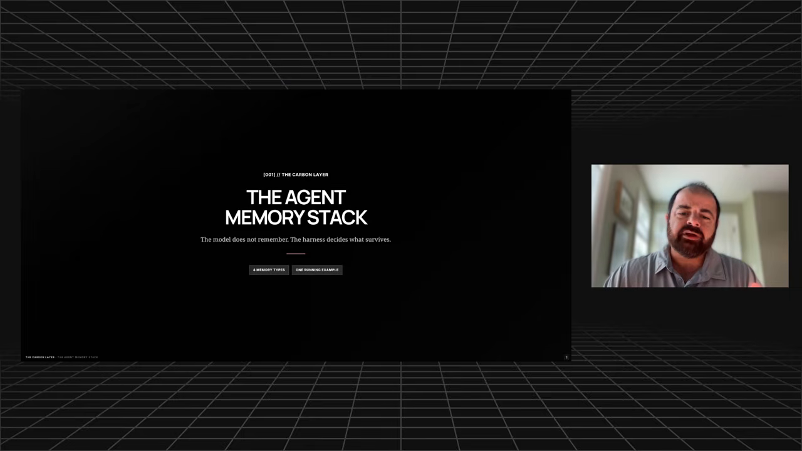 |
| 02 | Same Chat Remembers. New Session Forgets. (01:38) | 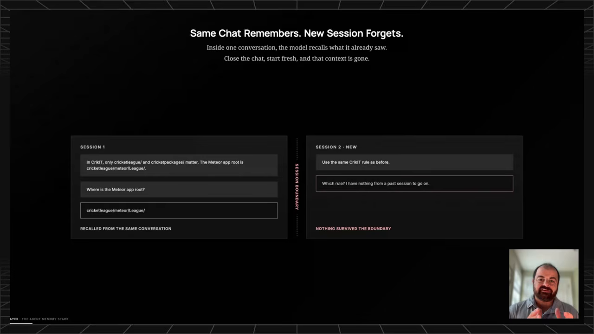 |
| 03 | CrikIT Issue #9 (03:42) | 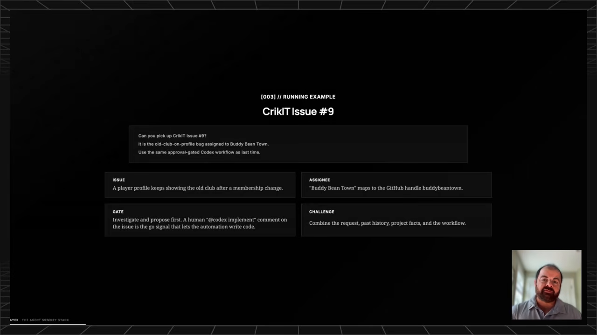 |
| 04 | Working Memory Is The Desk (05:47) | 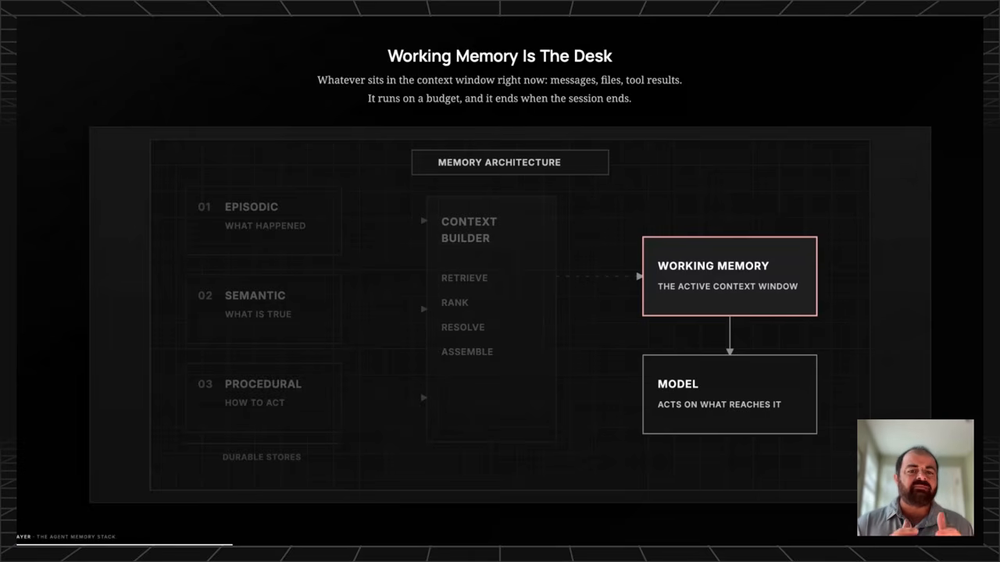 |
| 05 | Episodic Memory: What Happened (08:26) | 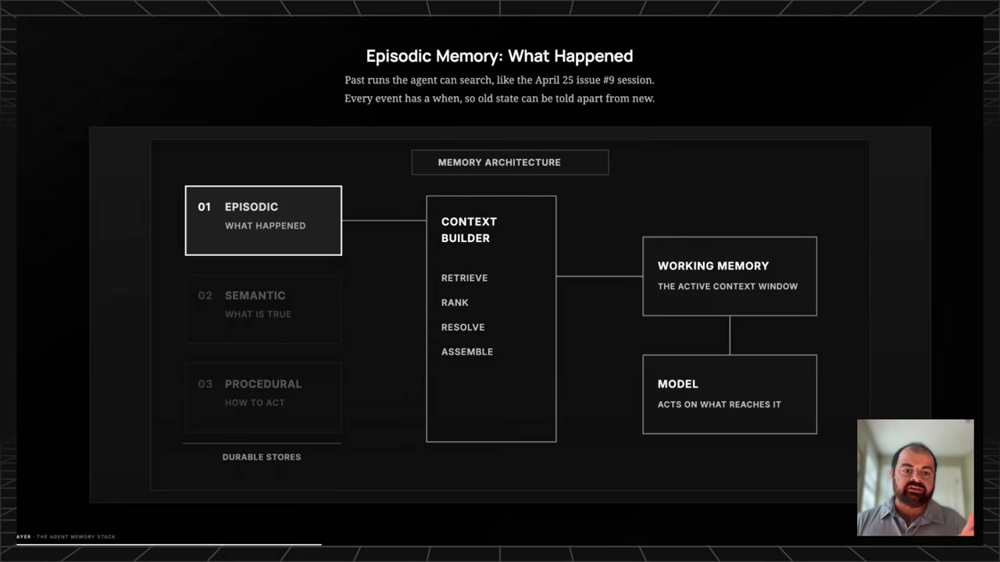 |
| 06 | Semantic Memory: What Is True (10:43) | 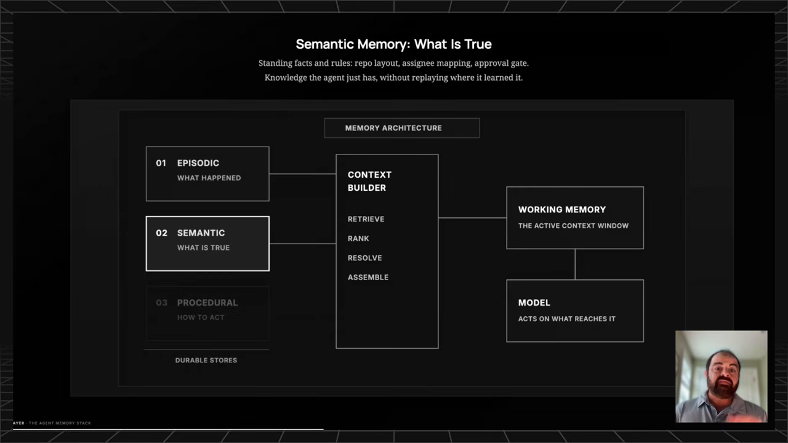 |
| 07 | Procedural Memory: How To Act (14:06) | 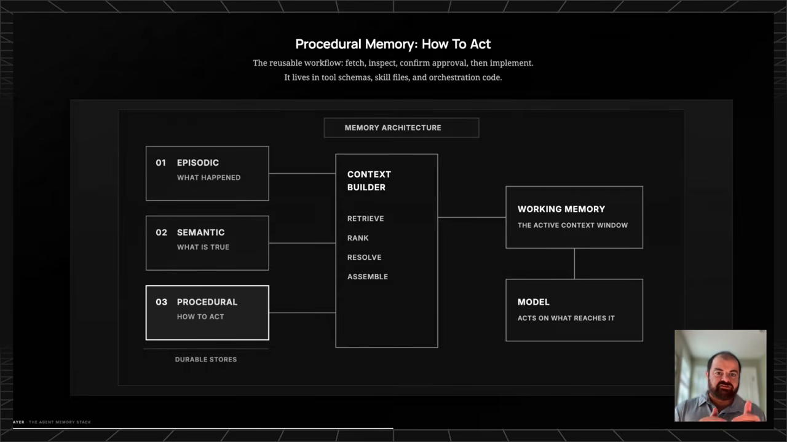 |
| 08 | Working Memory Is Where They Become Usable (16:50) | 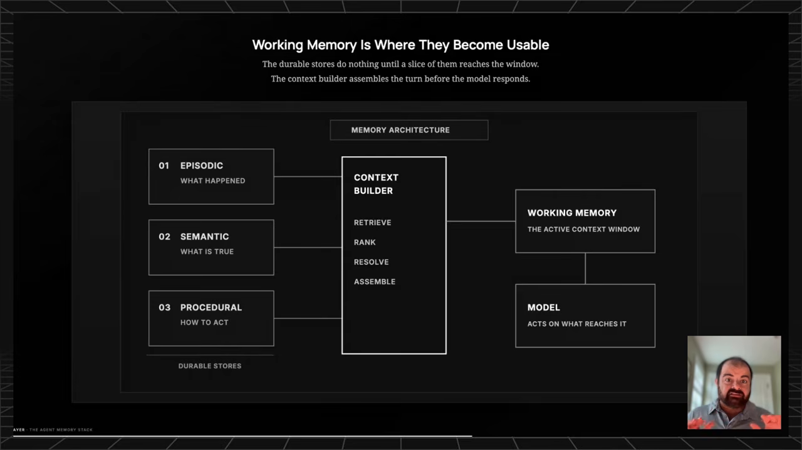 |
| 09 | One Request, Four Systems Assembled (18:26) | 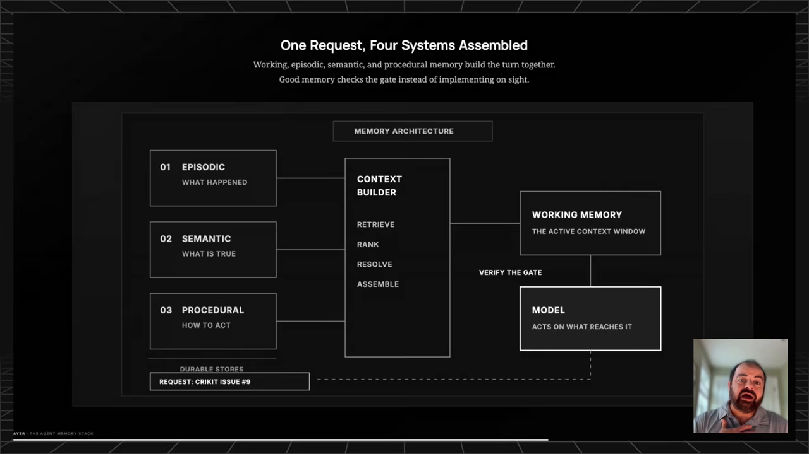 |
| 10 | Memory Is Context Assembly Over Time (19:43) | 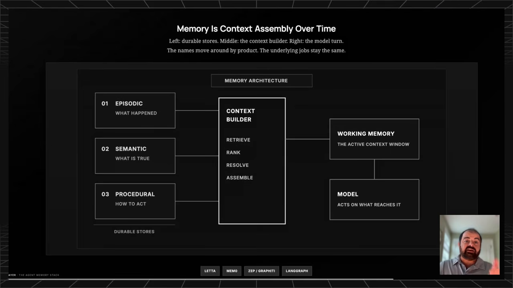 |
| 11 | The Interesting Failures Are Conflicts (21:37) | 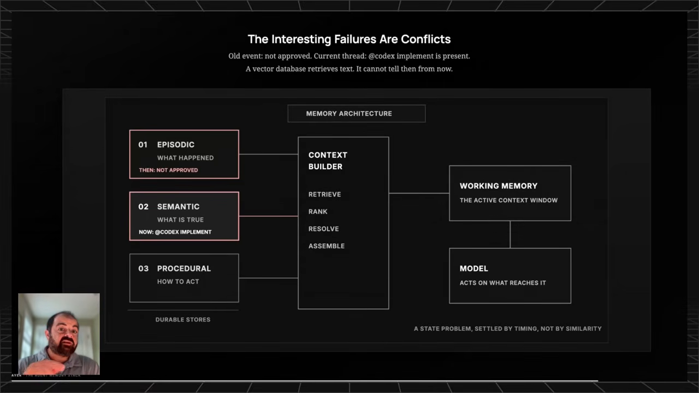 |
| 12 | Forgetting Is Hygiene (22:49) | 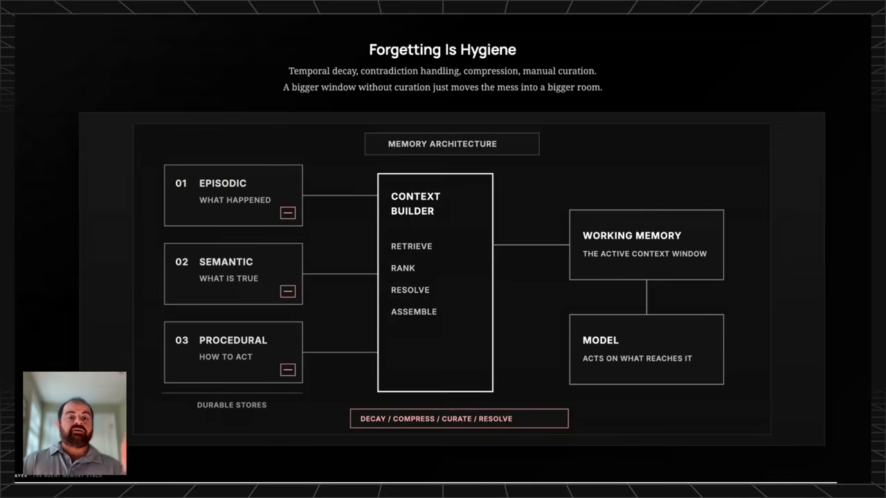 |
| 13 | Five Questions For Any Agent (25:48) | 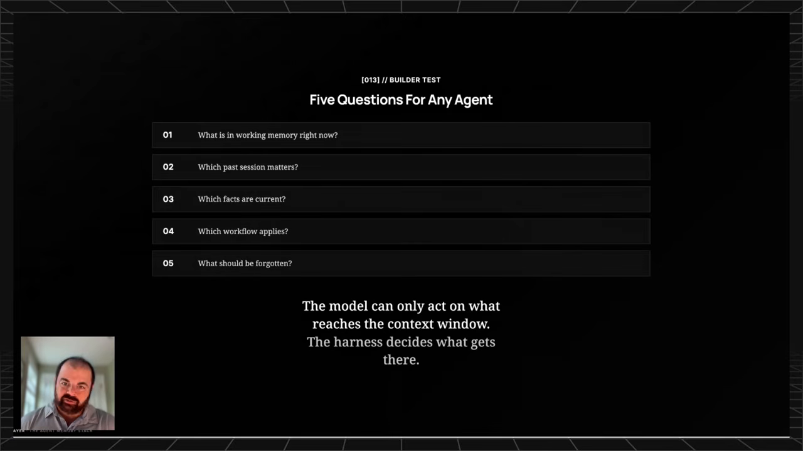 |

---

*Generated from the video's transcript and 328 frame captures (5 s intervals; unclear frames re-captured at ±1–2 s for clarity).*
